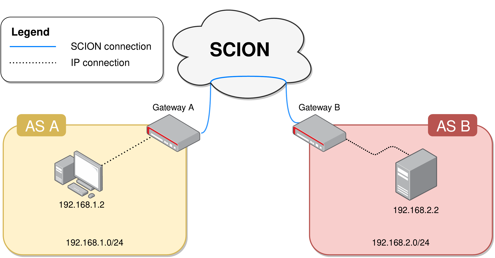

SEG (SCION Extensible Gateway)
---

The SEG (SCION Extensible Gateway) offers a framework to take advantage of the SCION architecture using existing
protocols and applications.

The goal of the SEG is to offer a VPN like environment composed of peering SEGs that interconnect over the SCION internet.
For the ones who are familiar with the SIG (SCION IP Gateway), the SEG is a more generalized and extensible SIG.

From a developer perspective, all it takes to use the SEG is to develop an Adapter implementing the `gateway.Adapter` interface.

# Features

The SEG offers several managed features that a developer can take advantage of:
1. Bidirectional control and data channels with each peer,
2. E2E encryption (based on DRKey) of all communications with other peers,
3. Connection probing and path management with automatic failover in case of connection disruption, and
4. Hidden path establishment (and failover) with peer SEG.

# IP example
To make clearer how the SEG can be used we show an example IP setup.  
This setup can be used with any IP based applications, to name a few:
1. SSH access to devices, or
2. exposing an HTTP webserver.

## Topology


## IPAdapter
The code for this example can be found in `main.go`, and the adapter used (the IPAdapter) can be found [here](gateway/adapters/ip/).

## Configuration files
For the sake of brevity we only show the configuration of gateway A (configuration of gateway B can be easily derived from it)
### Gateway configuration `conf.yaml`
```
address: A,127.0.0.1:23000
remotes:
  - address: B,127.0.0.1:23000
adapterConfPath: adapter.yaml
```
### IPAdapter configuration `adapter.yaml`
```
addr: 192.168.1.100
subnet: 192.168.1.100/32
tunName: seg
```

## Compile and run
First, `git clone` this repository locally.

Second, compile the binaries with `go build`.  
If you intend to run the compiled binary on a different machine, it's easier to compile the binary statically, to avoid incompatibility issues.
For a statical compilation use the following flags `-ldflags="-extldflags=-static" -tags sqlite_omit_load_extension`.

Finally, give the binary `CAP_NET_ADMIN` capabilities and run it in a folder with the respective `conf.yaml` and `adapter.yaml`
configuration files (a different path can also be specified).